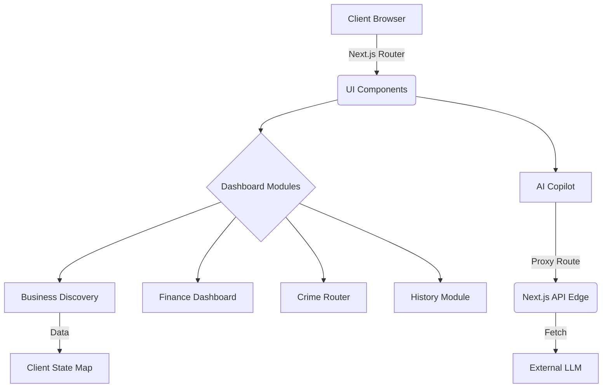

# System Architecture

## Overview
AI City Copilot is a Next.js 15 (App Router) based dashboard designed to run autonomously with high resilience. It combines client-side interactive routing, server-rendered components, and Next.js Edge proxy servers for seamless backend integrations.

## Core Stack
- **Framework**: Next.js 15
- **Language**: TypeScript
- **Styling**: Tailwind CSS v4, Lucide React (Iconography)
- **Map System**: Leaflet / React-Leaflet
- **Data Visualization**: Recharts
- **Deployment**: Vercel

## System Diagram

## Module Breakdown

1. **Dashboard Home (/app/page.tsx)**: Integrates the AI Copilot hero unit, Finance Dashboard, and the Local Discovery grid.
2. **AI Copilot (services/aiCopilotService.ts)**: Handles contextual queries routed through `/api/chat` to protect keys. Implements Web Speech API for voice interactions.
3. **Map System (components/Map.tsx)**: Lazy-loaded Leaflet mapping bypassing SSR constraints. Uses a customized dark Carto tile layer for the huly.io aesthetic.
4. **Data Integrations**: Mocks Bright Data and SODA endpoints for resilient hackathon demonstrations. Data structures are deterministic.

## Security Constraints
- All backend calls are proxied through route handlers (`proxy.ts` / API directories) to obscure API keys.
- Rate limiting is structurally supported via Vercel Edge rules.
- `noindex` headers dictate the app should remain unindexed.
