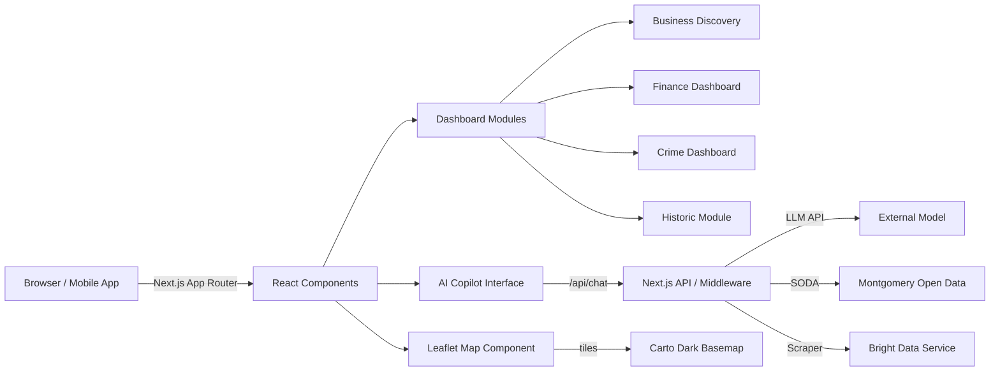

# System Architecture

**AI City Copilot** (a.k.a. *Montgomery Atlas*) is built on Next.js 16 using the App Router. The application combines client-side interactivity, server components, and lightweight edge middleware to create a modular, maintainable smart‑city dashboard.

## Core Stack
- **Framework**: Next.js 16 (App Router)
- **Language**: TypeScript
- **Styling**: Tailwind CSS v4, custom dark theme
- **Icons**: Lucide React
- **Mapping**: Leaflet via `react-leaflet` with Carto dark basemap
- **Charts**: Recharts
- **Runtime**: Node 20 on Vercel or any Node host

## High‑Level Diagram


## Directory Structure
```
/app             # Next.js pages and layouts (App Router)
/components      # Reusable UI components
/lib             # Business logic, API wrappers, generators
/hooks           # Custom React hooks (voice, etc.)
/data            # Static arrays and test data
/public          # Static assets (images, icons)
/styles          # Tailwind globals and overrides
```

## Key Modules
1. **App shell (`/app/layout.tsx`, `globals.css`)** - dark, OS‑style workspace with a sticky toolbar and full‑screen overlay menu.
2. **AI Copilot (`/components/` + `/lib/aiCopilotService.ts`)** - voice/text chat UI; server‑side LLM requests via `/app/api/*` routes.
3. **Map (`/components/Map.tsx`)** - dynamic client component loaded only in the browser, avoids SSR errors.
4. **Business discovery & job generator** - data functions live under `/lib`, UI under `/components` or `app` pages.
5. **Middleware (`middleware.ts`)** - rate limiting, prompt injection checks, security headers, and noindex policy.
6. **API routes (`/app/api/*/route.ts`)** - health, chat, scrapers, etc.; execute without Express.

## Security & Compliance
- **Middleware** enforces IP‑based rate limits and scans POST bodies for prohibited phrases.
- **No analytics**: `X-Robots-Tag: noindex, nofollow`; zero tracking.
- **Prompt injection** rules are hard‑coded with clear error responses.

## Evolution Path
- Move heavyweight operations (scraping, LLM orchestration) into edge workers or serverless functions.
- Add Redis cache for business and itinerary results.
- Abstract city data to configuration for multi‑city support.

*This document replaces earlier references to Next.js 15 and Express; the current codebase adheres to the new structure.*
